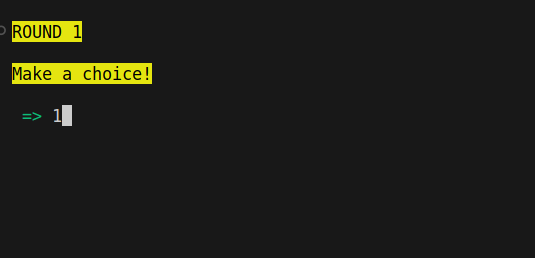
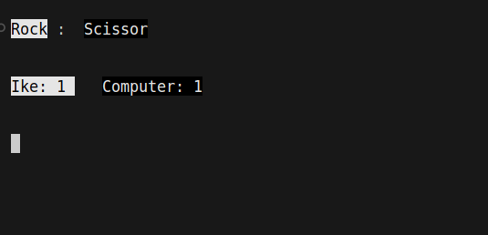
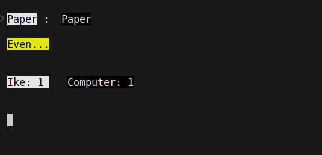
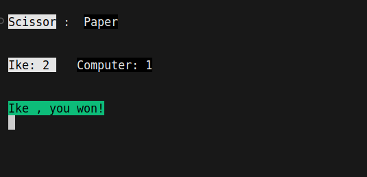
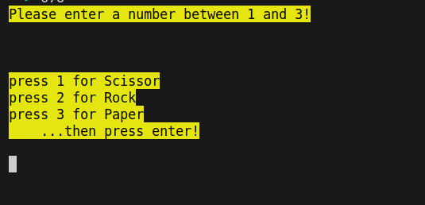

# Rock, Paper, Scissors CLI Game

Welcome to my first JavaScript project, a command-line interface (CLI) game of "Rock, Paper, Scissors"! In this game, you'll be able to play the classic hand game against the computer in your terminal.

## Technologies Used

This project is built using the following technologies:

- **Asynchronous Programming**: Leveraging asynchronous patterns for smooth gameplay.
- **Modular Programming**: Code is organized into modules for easy maintenance.
- **Node.js**
- **Typewriter Effect**: Adds a fun and interactive typewriter effect to the game.
- **Coloured Output**: Uses the npm package `chalk` to add color to the terminal output for enhanced readability.
- **User Input**: Takes user input using the `readline` library.

## How to Play

- clone the repo
- npm install
- node game.js

## Contributing

Feel free to contribute to this project by submitting issues, fixing bugs, or suggesting improvements.

// Include any additional sections such as license, acknowledgements, etc.

Enjoy the game!

